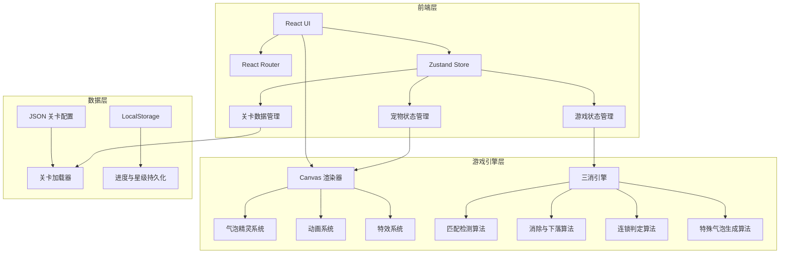

## 1. 架构设计



## 2. 技术说明

- **前端框架**：React@18 + TypeScript + Vite
- **样式方案**：Tailwind CSS@3
- **状态管理**：Zustand（游戏状态、关卡进度、宠物状态）
- **游戏渲染**：Canvas 2D（气泡棋盘渲染、动画、特效）
- **路由**：React Router DOM v6
- **数据持久化**：LocalStorage（关卡进度、星级、设置）
- **关卡数据**：JSON 配置文件驱动
- **构建工具**：Vite
- **包管理器**：npm

## 3. 路由定义

| 路由 | 用途 |
|------|------|
| `/` | 选关地图页，展示关卡路径和进度 |
| `/game/:levelId` | 游戏棋盘页，核心三消玩法 |

## 4. 数据模型

### 4.1 关卡进度数据（LocalStorage）

```typescript
interface LevelProgress {
  levelId: number;
  stars: 0 | 1 | 2 | 3;
  completed: boolean;
  bestScore: number;
}

interface GameSave {
  levels: LevelProgress[];
  totalRelaxValue: number;
  currentLevel: number;
}
```

### 4.2 游戏状态数据（Zustand Store）

```typescript
interface Cell {
  color: BubbleColor | null;
  special: SpecialType | null;
  isObstacle: boolean;
}

type BubbleColor = 'cat' | 'dog' | 'pig' | 'fish' | 'clover' | 'orange';
type SpecialType = 'rowClear' | 'colClear' | 'bomb';

interface GameState {
  board: Cell[][];
  selected: { row: number; col: number } | null;
  movesLeft: number;
  targets: Target[];
  relaxValue: number;
  maxRelaxValue: number;
  petMood: 'idle' | 'cheer' | 'tense';
  ultimateUsed: boolean;
  shuffleUsed: number;
  undoLeft: number;
  invalidSwaps: number;
  undoStack: BoardSnapshot[];
  levelId: number;
}
```

### 4.3 关卡配置 JSON

```typescript
interface LevelConfig {
  id: number;
  moves: number;
  colors: BubbleColor[];
  targets: Target[];
  obstacles: { row: number; col: number }[];
  bonusMoves?: number;
  shuffleLimit: number;
}

interface Target {
  type: 'eliminate' | 'collectSpecial';
  color?: BubbleColor;
  count: number;
}
```

## 5. 核心算法设计

### 5.1 匹配检测算法
- 水平扫描：遍历每行，检测连续3+同色（非障碍物）格子
- 垂直扫描：遍历每列，检测连续3+同色（非障碍物）格子
- L/T 形检测：水平和垂直匹配有交叉点时识别为 L/T 形

### 5.2 特殊气泡生成规则
- 4 连消 → 行清除或列清除（根据消除方向）
- 5 连消 → 全色炸弹
- L/T 形 → 行清除 + 列清除（十字效果）

### 5.3 特殊气泡组合效果
- 行清 + 行清 → 清除两行
- 列清 + 列清 → 清除两列
- 行清 + 列清 → 十字全清
- 任意 + 炸弹 → 全色炸弹效果增强
- 炸弹 + 炸弹 → 全屏清除

### 5.4 重力下落算法
- 从底部向上扫描每列
- 遇到空格时，从上方找到最近的非空非障碍物格子下落
- 列顶空格从备选颜色池随机填充

### 5.5 连锁判定
- 下落填充后重新执行匹配检测
- 如有新匹配则继续消除，直到无新匹配
- 每次连锁增加轻松值加成倍率

## 6. 项目目录结构

```
src/
  components/
    Board/           # 游戏棋盘 Canvas 组件
    Pet/             # 宠物助威区组件
    Map/             # 选关地图组件
    Result/          # 结算弹窗组件
    UI/              # 通用 UI 组件（按钮、进度条等）
  engine/
    matcher.ts       # 匹配检测算法
    eliminator.ts    # 消除与特殊气泡生成
    gravity.ts       # 重力下落算法
    chain.ts         # 连锁判定
    board.ts         # 棋盘状态管理
    renderer.ts      # Canvas 渲染器
    animator.ts      # 动画系统
    special.ts       # 特殊气泡效果处理
  store/
    gameStore.ts     # 游戏状态 Zustand Store
    levelStore.ts    # 关卡进度 Zustand Store
  data/
    levels.json      # 15+ 关卡配置数据
  pages/
    MapPage.tsx      # 选关地图页
    GamePage.tsx     # 游戏页
  types/
    index.ts         # 全局类型定义
  utils/
    storage.ts       # LocalStorage 工具
    random.ts        # 随机数与洗牌工具
```
